# Colour Cinema
## Proyecto de aplicación para el curso de Videojuegos y aplicaciones Móviles
### Resumen
El videojuego presentado a continuación tiene como historia la de un personaje en busca de la paleta de colores de la fotografía de una película en específico. El principal objetivo es aprender en profundidad de la composición de colores de una escena, para permitir el aprendizaje por parte del jugador de los conceptos básicos de la teoría de colores.
Como solución a esta propuesta se implementó un videojuego de tipo “Falling Block”, en el cual cada bloque es asignado con un color del conjunto de paleta de colores de los films rescatados y el jugador tiene como misión evitar colisionar con un color que no pertenezca a la paleta de colores de la fotografía mostrada. Finalmente, el videojuego fue implementado con el motor de videojuegos Unity y el lenguaje de programación C#.
## Desarrollo
Se inició con el proceso de selección de 5 películas con una paleta de colores sobresaliente, cada película tiene características diferentes, lo que mejorará el aprendizaje de los participantes. Las 5 películas seleccionadas fueron:
#### Blade Runner (1982) por Ridley Scott
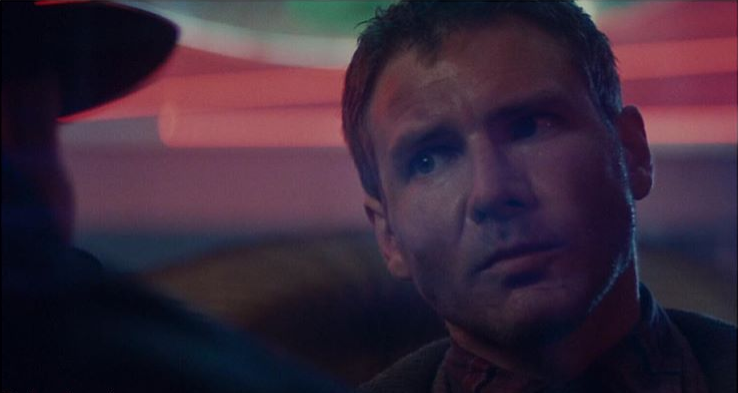
#### Interstellar (2014) por Cristopher Nolan
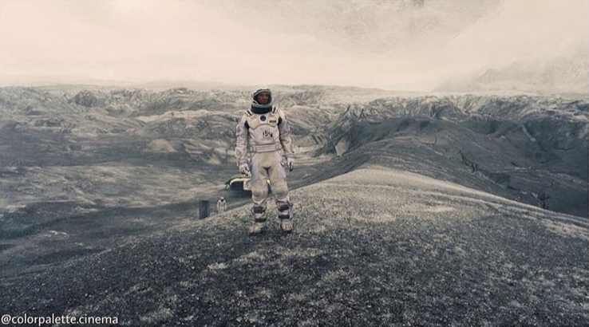
#### Call Me By Your Name (2017) por Luca Guadagnino

#### Moonrise Kingdom (2012) por Wes Anderson
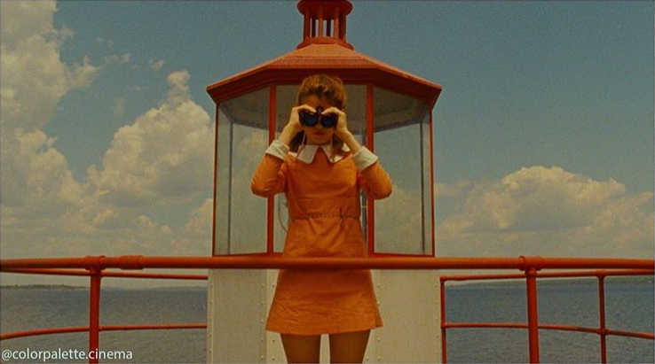
#### Suspiria (1977) por Dario Argento
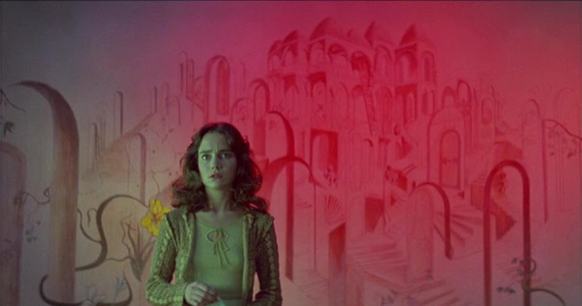
### Unity
Se inició creando los objetos en la escena.
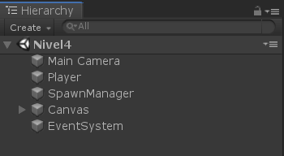
El GameObject **Player** sería el personaje principal del videojuego, y su ubicación en escena sería la siguiente.
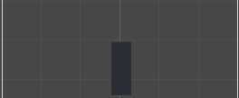
El **Canvas** es responsable de contener los elementos de la UI, entre ellos encontramos la vida del personaje, el puntaje que va obteniendo en cada nivel y la fotografía de la película.
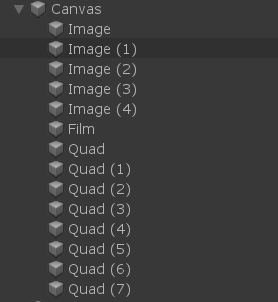
Los elementos con el nombre **Image** corresponden a la vida del personaje. Se utilizaron corazones para su representación.
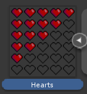
**Film** viene a ser la fotografía de la película que corresponde a ese nivel.
Los elementos **Quad** son los indicadores del puntaje del personaje, y su representación son cuadrados que posteriormente se le asignará el color que el jugador vaya coleccionando.
**SpawnManager** se encargará de generar los ++FallingBlocks++ que el jugador tendrá que esquivar o atrapar en caso pertenezca a la paleta de colores.
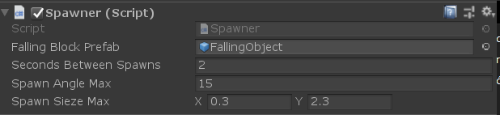
Este objeto recibe un script *Spawner* que se encargará de gestionar la generación de cada bloque. Los elementos **Seconds Between Spawns** y **Spawn Angle Max** se usan para asignar los segundos de generación de cada bloque y el ángulo límite de rotación respectivamente, mientras que **Spawn Size Max** se encarga de asignar el máximo del tamaño del bloque. Estos dos últimos atributos son necesarios, debido a que el tamaño y el ángulo asignados a los bloques son valores aleatorios en los rangos de estos valores. 
En el inspector del **SpawnManager** se puede observar también el **Prefab** asignado el cual es un cubo con las siguientes características.
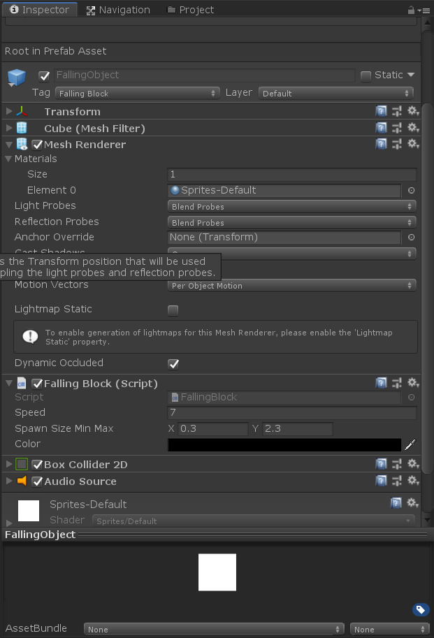
Con respecto a **Mesh Renderer** se asignó como elemento *Sprites-Default* debido que este objeto se debe renderizar como un Sprite para poder asignarle un color. El script **FallingBlock** asociado especifica la velocidad con la que el bloque debe caer, y el color por defecto que este debe tener. También se agregaron como componentes **Box Collider 2D** para el manejo de colisiones y **Audio Source** para asignar un clip de audio que será utilizado para cuando el bloque sea generado y de un estado de alerta al jugador.
### ¿Cómo se asignaron los colores?
Como punto de partida, se obtuvieron los colores correspondientes a cada fotografía.
#### Blade Runner

1. 0x07162D
2. 0x1E2E45
3. 0x412740
4. 0x493D55
5. 0x684354
6. 0xA6595F
7. 0xA24B53
8. 0x813050
9. 0x3B735A
10. 0x838D84

#### Interstellar
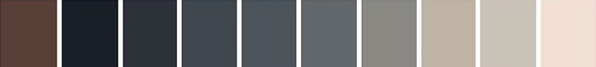
1. 0x5A3F36
2. 0x181F27
3. 0x2D3238
4. 0x3F464E
5. 0x4D545C
6. 0x62676B
7. 0x898883
8. 0xC0B4A4
9. 0xC8C2B6
10. 0xF2DFD1

#### Call Me By Your Name

1. 0x0E1810
2.   0x66402D
3.   0x936F4D
4.   0xD2D0A7
5.   0xCCE7C6
6.   0xB4D3A7
7.   0x87CD8F
8.   0x69C2A4
9.   0x29B1A5
10.   0x365B61

#### Moonrise Kingdom

1. 0x410D00
2. 0x831901
3. 0x983E00
4. 0xB56601
5. 0xAB8437
6. 0xB29F74
7. 0x7F816B
8. 0x587571
9. 0x596C72
10. 0x454F51

#### Suspiria

1. 0x3D4631
2. 0x617F5B
3. 0x948824
4. 0x817359
5. 0x6A555E
6. 0x8C4A54
7. 0x8C3B5C
8. 0xA92D47
9. 0xA9051D
10. 0x820D20

Posteriormente de implementó la siguiente clase estática conteniendo los colores anteriormente señalados.
```
public static class Colours
    {
        public static readonly List<int> ColourPalette = new List<int>()
        {
            // Moonrise Kingdom (2012)
            0x410D00,
            0x831901,
            0x983E00,
            0xB56601,
            0xAB8437,
            0xB29F74,
            0x7F816B,
            0x587571,
            0x596C72,
            0x454F51,
            
            // Call Me By Your Name (2017)
            0x0E1810,
            0x66402D,
            0x936F4D,
            0xD2D0A7,
            0xCCE7C6,
            0xB4D3A7,
            0x87CD8F,
            0x69C2A4,
            0x29B1A5,
            0x365B61,

            // Blade Runner (1982)
            0x07162D,
            0x1E2E45,
            0x412740,
            0x493D55,
            0x684354,
            0xA6595F,
            0xA24B53,
            0x813050,
            0x3B735A,
            0x838D84,

            // Interstellar (2014)
            0x5A3F36,
            0x181F27,
            0x2D3238,
            0x3F464E,
            0x4D545C,
            0x62676B,
            0x898883,
            0xC0B4A4,
            0xC8C2B6,
            0xF2DFD1,

            // Suspiria (1977)
            0x3D4631,
            0x617F5B,
            0x948824,
            0x817359,
            0x6A555E,
            0x8C4A54,
            0x8C3B5C,
            0xA92D47,
            0xA9051D,
            0x820D20
        };
    }
```
Esta clase fue de gran utilidad para asignar los colores aleatoriamente a los **FallingBlock**.
```
List<int> colourPalette = Colours.ColourPalette;

int colourIndex = Random.Range(0, colourPalette.Count);

System.Drawing.Color color = System.Drawing.Color.FromArgb(colourPalette[colourIndex]);

MeshRenderer rend = GetComponent<MeshRenderer>();

rend.material.color = new Color32(_color.R, _color.G, _color.B,255);
```

Para seleccionar los colores que pertezcan a la fotografía de la escena en nuestro **PlayerController**, se escribió el siguiente código en la función *Start*.
```
GameObject imageGameObject = GameObject.FindWithTag("Film");

Image image = imageGameObject.GetComponent<Image>();

string imageName = image.sprite.name;

_colours = GetActiveColors(imageName);
```
Como se puede observar, se obtiene la imagen de la escena con el tag *Film* y con su atributo nombre se procede a obtener todos los colores y almacenarlos en el atributo privado **_colours**.
```
List<Color32> GetActiveColors(string imageName)
    {
        List<int> coloursCode;

        switch (imageName)
        {
            case "Interstellar":
                coloursCode = Colours.ColourPalette.GetRange(30,9);
                break;
            case "Blade_Runner_1982":
                coloursCode = Colours.ColourPalette.GetRange(20, 9);
                break;
            case "Call_Me_By_Your_Name":
                coloursCode = Colours.ColourPalette.GetRange(10, 9);
                break;
            case "Moonrise_Kingdom":
                coloursCode = Colours.ColourPalette.GetRange(0, 9);
                break;
            case "Suspiria_1977":
                coloursCode = Colours.ColourPalette.GetRange(40, 9);
                break;
            default: return null;
        }

        return coloursCode.Select(Color.FromArgb).
                        Select(colorArgb => new Color32(colorArgb.R, 							colorArgb.G, colorArgb.B, 255)).
                        ToList();
    }

}
```
La función presentada anteriormente devuelve una lista con los colores del nombre de la fotografía que se le pasa como parámetro.
### ¿Cómo funciona el sistema de puntos?
Como punto inicial, en nuestro **PlayerController** se crea la función necesaria para detectar las colisiones de nuestro objeto. La función *OnTriggerEnter2D*.
1. La primera tarea es identificar si el color del bloque pertenece a la paleta de colores de la imagen.
```
	GameObject fallingBlockGameObject = GameObject.FindGameObjectWithTag("Falling Block");

	FallingBlock fallingBlock = fallingBlockGameObject.GetComponent<FallingBlock>();

	Color32 color = fallingBlock.color;
    	if (_colours.Contains(color))
	{
    		// Se implementa toda la lógica de suma de puntos    
	}
    
    	// En caso no haya fallado se resta la vida del jugador 
	health.health--;

	if (health.health != 0) return;
	health.hearts[0].sprite = health.emptyHeart;
	
    	// En caso la vida llegó a 0 destruye al jugador y carga la escena de **GameOver**
	Destroy(gameObject);

	Loader.Load(Loader.Scene.GameOver);
```
2. Dentro de la sentencia *If* se implementa el siguiente código para el manejo del score.
```
	    // Verifica que el color no esté en el score
            if (score.scores.Select(i => 
                    i.GetComponent<MeshRenderer>().material.color)
                    .Any(_color => ((Color32) _color).Equals(color)))
            {
                return;
            }
			
            // Aumenta el puntaje
            score.score++;

	    // Obtiene el sprite al que se le asignará el color acertado
            MeshRenderer rend = score.scores[score.score -1].GetComponent<MeshRenderer>();

	    // Se le asigna el color
            rend.material.color = new Color32(color.r, color.g, color.b, 255);
			
            // Carga la siguiente escena en caso completó todo el score
            if (score.score == score.totalScore)
            {
                Loader.NextScene();
            }

            return;
```

### Resultado del juego
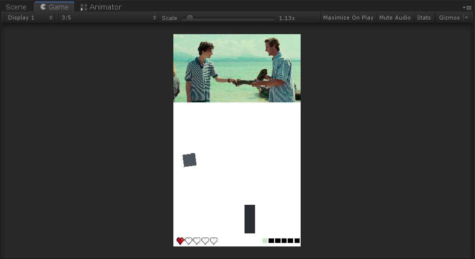
Finalmente se puede observar la escena del juego, con el bloque de un color generado aleatoriamente dentro de la lista de colores y los indicadores de puntaje y de vida, además de la fotografía de la película.


